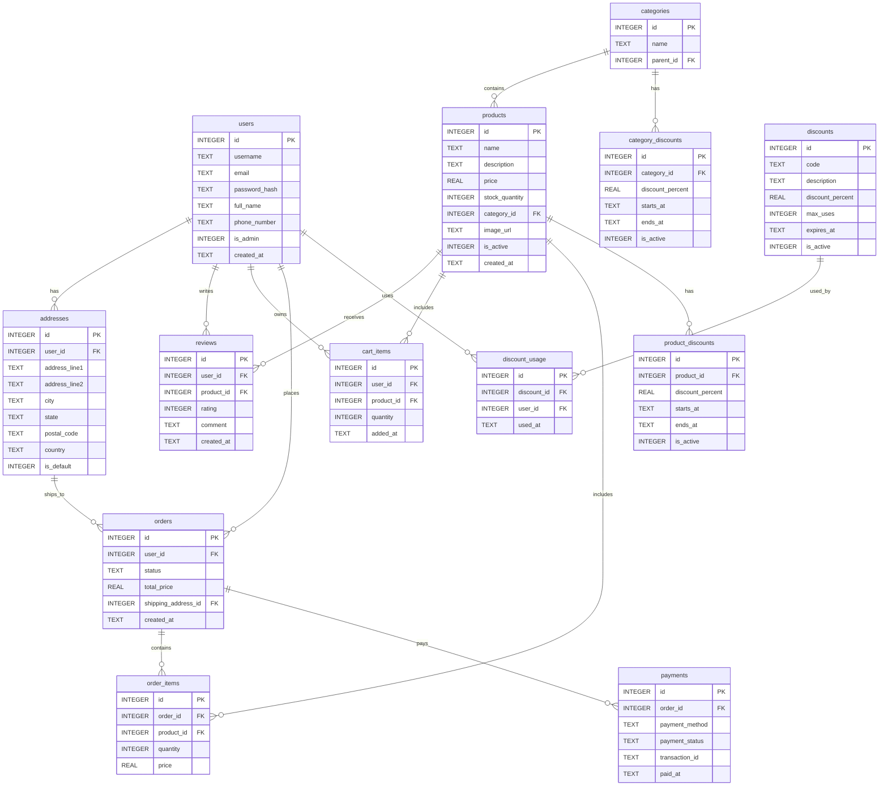

# قاعدة بيانات Shoppica

## مخطط العلاقات (ER Diagram)

يوضح المخطط التالي العلاقات بين الجداول في قاعدة بيانات Shoppica باستخدام ترميز Mermaid:

## وصف قاعدة البيانات

قاعدة بيانات **Shoppica** هي قاعدة بيانات علائقية مصممة لتطبيق تجارة إلكترونية، تحتوي على 13 جدولًا تدعم إدارة المستخدمين، المنتجات، الطلبات، الدفعات، الخصومات، والمراجعات. الجداول منظمة لدعم وظائف التجارة الإلكترونية الأساسية. يلي جدول يوضح تفاصيل كل جدول:

| **الجدول**            | **الوصف**                                                                 | **الحقول**                                                                 | **العلاقات**                                                                                   | **الدور**                                                                 |
|------------------------|---------------------------------------------------------------------------|-----------------------------------------------------------------------------|------------------------------------------------------------------------------------------------|---------------------------------------------------------------------------|
| **users**             | يحتوي على بيانات المستخدمين بما في ذلك بيانات التعريف وتفاصيل الاتصال. | `id` (PK), `username`, `email`, `password_hash`, `full_name`, `phone_number`, `is_admin`, `created_at` | واحد إلى متعدد مع: `addresses`, `reviews`, `cart_items`, `orders`, `discount_usage`            | يتيح تسجيل المستخدمين وإدارة الحسابات وتحديد الأدوار (عملاء أو مسؤولين).  |
| **addresses**         | يحتوي على عناوين المستخدمين للشحن أو الفوترة.                          | `id` (PK), `user_id` (FK), `address_line1`, `address_line2`, `city`, `state`, `postal_code`, `country`, `is_default` | متعدد إلى واحد مع: `users`، واحد إلى متعدد مع: `orders`                                      | يوفر عناوين للشحن والفوترة مع إمكانية تحديد عنوان افتراضي لتسهيل الطلبات. |
| **categories**        | يحتوي على فئات المنتجات مع دعم الفئات الفرعية.                         | `id` (PK), `name`, `parent_id` (FK)                                         | واحد إلى متعدد مع: `products`, `category_discounts`، علاقة ذاتية عبر `parent_id`             | ينظم المنتجات في هيكلية هرمية لتسهيل التصفح والترويج.                   |
| **products**          | يحتوي على بيانات المنتجات بما في ذلك الأسعار وكميات المخزون.          | `id` (PK), `name`, `description`, `price`, `stock_quantity`, `category_id` (FK), `image_url`, `is_active`, `created_at` | متعدد إلى واحد مع: `categories`، واحد إلى متعدد مع: `reviews`, `cart_items`, `order_items`, `product_discounts` | يشكل كتالوج المنتجات الأساسي لعرض العناصر المتاحة للبيع.                |
| **reviews**           | يحتوي على تقييمات وتعليقات المستخدمين على المنتجات.                   | `id` (PK), `user_id` (FK), `product_id` (FK), `rating`, `comment`, `created_at` | متعدد إلى واحد مع: `users`, `products`                                                       | يعزز الثقة من خلال تقديم تقييمات وآراء العملاء حول المنتجات.            |
| **cart_items**        | يحتوي على المنتجات المضافة إلى سلة تسوق المستخدم.                     | `id` (PK), `user_id` (FK), `product_id` (FK), `quantity`, `added_at`         | متعدد إلى واحد مع: `users`, `products`                                                       | يتيح للمستخدمين اختيار المنتجات مؤقتًا قبل إتمام الشراء.                |
| **orders**            | يحتوي على بيانات الطلبات بما في ذلك الحالة والتكلفة الإجمالية.         | `id` (PK), `user_id` (FK), `status`, `total_price`, `shipping_address_id` (FK), `created_at` | متعدد إلى واحد مع: `users`, `addresses`، واحد إلى متعدد مع: `order_items`, `payments`         | يدير عملية الشراء من تقديم الطلب إلى تتبع حالته.                        |
| **order_items**       | يحتوي على تفاصيل المنتجات ضمن كل طلب.                                 | `id` (PK), `order_id` (FK), `product_id` (FK), `quantity`, `price`           | متعدد إلى واحد مع: `orders`, `products`                                                      | يربط المنتجات بالطلبات لتتبع الكميات والأسعار في كل طلب.               |
| **payments**          | يحتوي على بيانات معاملات الدفع للطلبات.                               | `id` (PK), `order_id` (FK), `payment_method`, `payment_status`, `transaction_id`, `paid_at` | متعدد إلى واحد مع: `orders`                                                                  | يسجل ويتتبع مدفوعات الطلبات لضمان إتمام المعاملات المالية.               |
| **discounts**         | يحتوي على أكواد الخصم العامة مع تفاصيل الصلاحية.                      | `id` (PK), `code`, `description`, `discount_percent`, `max_uses`, `expires_at`, `is_active` | واحد إلى متعدد مع: `discount_usage`                                                          | يوفر عروضًا ترويجية عامة لتحفيز المبيعات عبر أكواد خصم.                 |
| **discount_usage**    | يحتوي على سجل استخدام أكواد الخصم من قبل المستخدمين.                  | `id` (PK), `discount_id` (FK), `user_id` (FK), `used_at`                     | متعدد إلى واحد مع: `discounts`, `users`                                                      | يتتبع استخدام الخصومات للتحكم في حدود الاستخدام والصلاحية.              |
| **product_discounts** | يحتوي على الخصومات المطبقة على منتجات محددة.                          | `id` (PK), `product_id` (FK), `discount_percent`, `starts_at`, `ends_at`, `is_active` | متعدد إلى واحد مع: `products`                                                                | يدعم العروض الترويجية المستهدفة لمنتجات معينة.                           |
| **category_discounts**| يحتوي على الخصومات المطبقة على فئات المنتجات.                         | `id` (PK), `category_id` (FK), `discount_percent`, `starts_at`, `ends_at`, `is_active` | متعدد إلى واحد مع: `categories`                                                              | يتيح تطبيق العروض الترويجية على مجموعات من المنتجات ضمن فئات محددة.      |

## ملاحظات إضافية
- **هيكلية الملفات**: تقع قاعدة البيانات ضمن مجلد `database/` في مشروع Shoppica، مع ملفات Python لكل نموذج (مثل `user.py`, `product.py`) وملف قاعدة البيانات `shop.db`.
- **المسار**: يتم حفظ هذا الملف في `docs/ar/database.md` لدعم التوثيق باللغة العربية.
- **الاستخدام**: تدعم قاعدة البيانات وظائف التجارة الإلكترونية مثل تصفح المنتجات، معالجة الطلبات، والدفع، مع ميزات متقدمة مثل الخصومات.