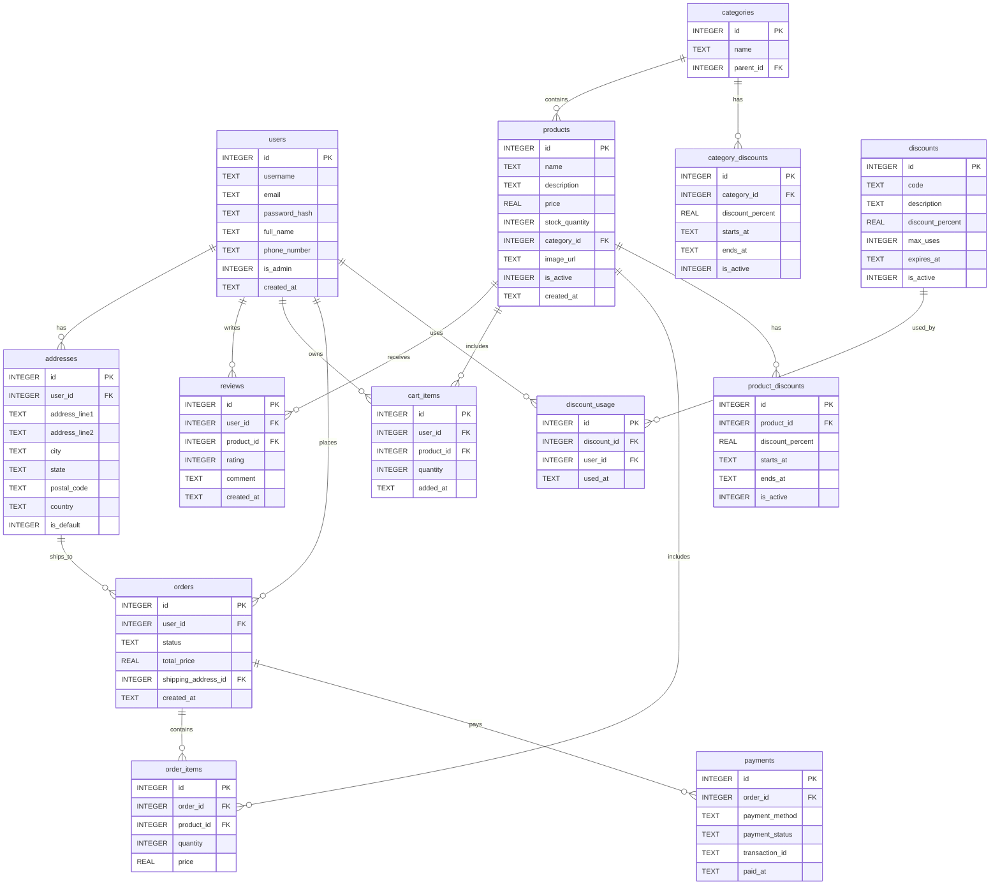

# Shoppica Database

## Entity-Relationship Diagram (ER Diagram)

The following diagram illustrates the relationships between tables in the Shoppica database using Mermaid notation:

## Database Overview

The **Shoppica** database is a relational database designed for an e-commerce application, consisting of 13 tables that support user management, product catalog, order processing, payments, discounts, and reviews. The tables are structured to enable core e-commerce functionalities. Below is a detailed description of each table, organized in a table format for clarity:

| **Table**              | **Description**                                                   | **Fields**                                                                                                              | **Relationships**                                                                                             | **Role**                                                                                |
| ---------------------- | ----------------------------------------------------------------- | ----------------------------------------------------------------------------------------------------------------------- | ------------------------------------------------------------------------------------------------------------- | --------------------------------------------------------------------------------------- |
| **users**              | Contains user data, including identification and contact details. | `id` (PK), `username`, `email`, `password_hash`, `full_name`, `phone_number`, `is_admin`, `created_at`                  | One-to-many with: `addresses`, `reviews`, `cart_items`, `orders`, `discount_usage`                            | Enables user registration, account management, and role assignment (customer or admin). |
| **addresses**          | Stores user shipping or billing addresses.                        | `id` (PK), `user_id` (FK), `address_line1`, `address_line2`, `city`, `state`, `postal_code`, `country`, `is_default`    | Many-to-one with: `users`, one-to-many with: `orders`                                                         | Provides addresses for shipping and billing, with support for a default address.        |
| **categories**         | Contains product categories with support for subcategories.       | `id` (PK), `name`, `parent_id` (FK)                                                                                     | One-to-many with: `products`, `category_discounts`, self-referential via `parent_id`                          | Organizes products in a hierarchical structure for browsing and promotions.             |
| **products**           | Contains product details, including pricing and inventory levels. | `id` (PK), `name`, `description`, `price`, `stock_quantity`, `category_id` (FK), `image_url`, `is_active`, `created_at` | Many-to-one with: `categories`, one-to-many with: `reviews`, `cart_items`, `order_items`, `product_discounts` | Forms the core product catalog for displaying items available for sale.                 |
| **reviews**            | Contains user ratings and comments on products.                   | `id` (PK), `user_id` (FK), `product_id` (FK), `rating`, `comment`, `created_at`                                         | Many-to-one with: `users`, `products`                                                                         | Enhances trust by providing customer feedback and ratings on products.                  |
| **cart_items**         | Contains products added to a user's shopping cart.                | `id` (PK), `user_id` (FK), `product_id` (FK), `quantity`, `added_at`                                                    | Many-to-one with: `users`, `products`                                                                         | Allows users to select products temporarily before completing a purchase.               |
| **orders**             | Contains order details, including status and total cost.          | `id` (PK), `user_id` (FK), `status`, `total_price`, `shipping_address_id` (FK), `created_at`                            | Many-to-one with: `users`, `addresses`, one-to-many with: `order_items`, `payments`                           | Manages the purchase process from order submission to status tracking.                  |
| **order_items**        | Contains details of products within each order.                   | `id` (PK), `order_id` (FK), `product_id` (FK), `quantity`, `price`                                                      | Many-to-one with: `orders`, `products`                                                                        | Links products to orders, tracking quantities and prices per order.                     |
| **payments**           | Contains payment transaction details for orders.                  | `id` (PK), `order_id` (FK), `payment_method`, `payment_status`, `transaction_id`, `paid_at`                             | Many-to-one with: `orders`                                                                                    | Records and tracks order payments to ensure financial transactions are completed.       |
| **discounts**          | Contains general discount codes with validity details.            | `id` (PK), `code`, `description`, `discount_percent`, `max_uses`, `expires_at`, `is_active`                             | One-to-many with: `discount_usage`                                                                            | Provides promotional offers via discount codes to incentivize sales.                    |
| **discount_usage**     | Tracks usage of discount codes by users.                          | `id` (PK), `discount_id` (FK), `user_id` (FK), `used_at`                                                                | Many-to-one with: `discounts`, `users`                                                                        | Monitors discount code usage to enforce limits and validity.                            |
| **product_discounts**  | Contains discounts applied to specific products.                  | `id` (PK), `product_id` (FK), `discount_percent`, `starts_at`, `ends_at`, `is_active`                                   | Many-to-one with: `products`                                                                                  | Supports targeted promotional offers for specific products.                             |
| **category_discounts** | Contains discounts applied to product categories.                 | `id` (PK), `category_id` (FK), `discount_percent`, `starts_at`, `ends_at`, `is_active`                                  | Many-to-one with: `categories`                                                                                | Enables promotional offers for groups of products within specific categories.           |

## Additional Notes
- **File Structure**: The database resides in the `database/` directory of the Shoppica project, with Python files for each model (e.g., `user.py`, `product.py`) and the database file `shop.db`.
- **Path**: This documentation file is saved in `docs/en/database.md` to support English documentation.
- **Usage**: The database supports core e-commerce functionalities such as product browsing, order processing, and payments, with advanced features like product and category-specific discounts.